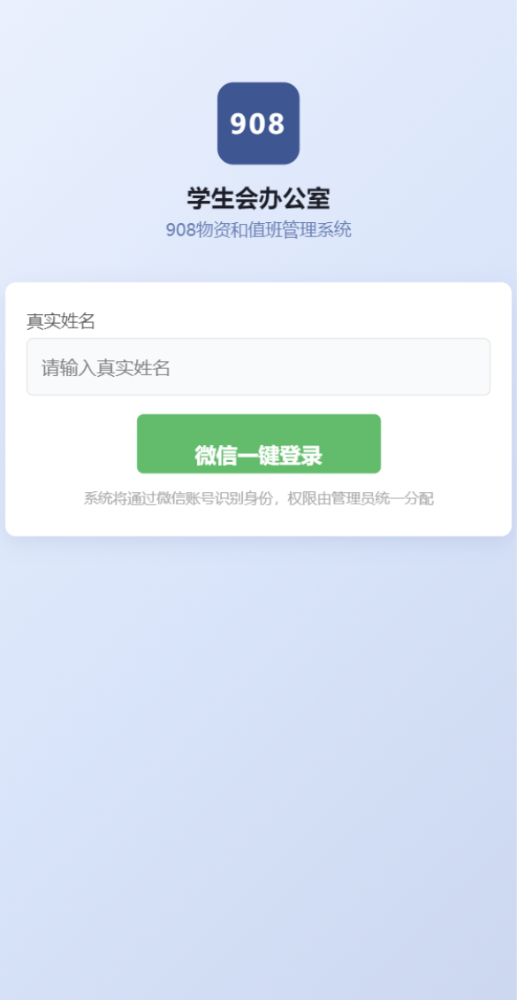
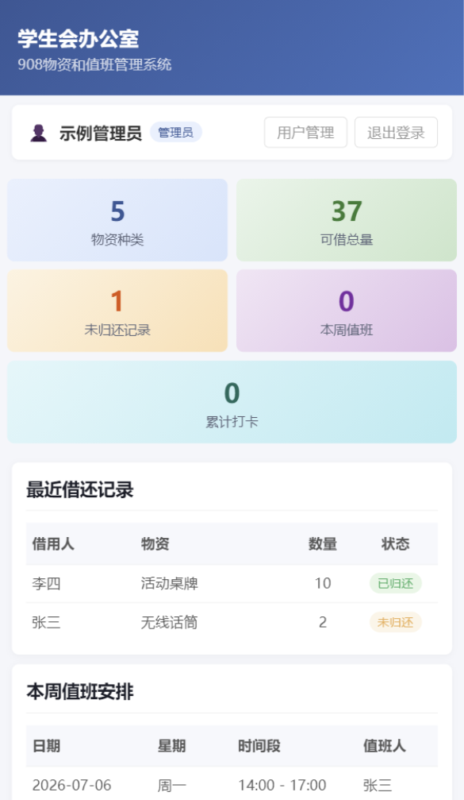
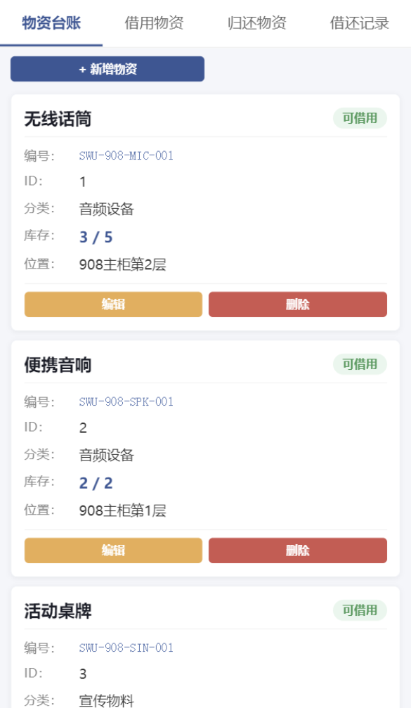
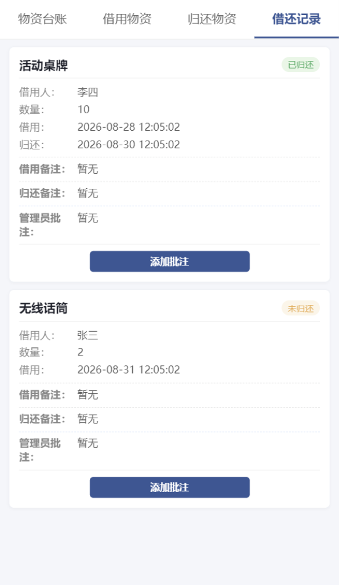
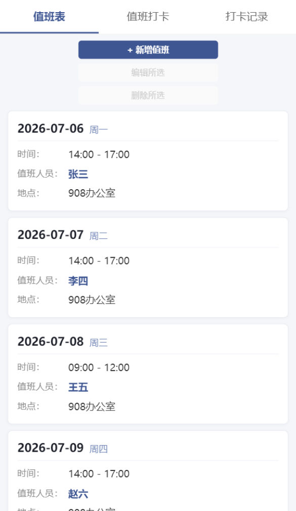
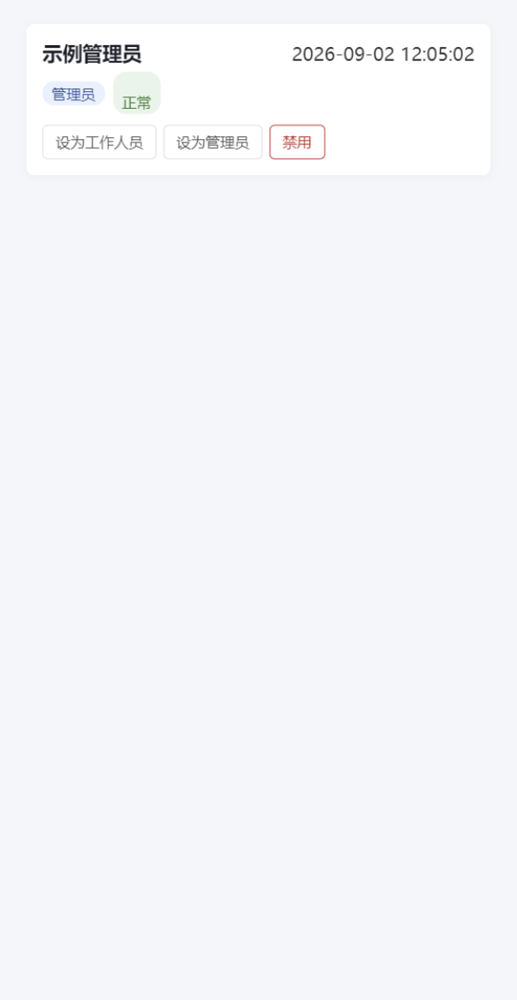

# 908 Office Management System

学生会办公室 908 物资和值班管理系统

基于微信小程序的办公室物资与值班管理工具，包含物资登记、借用归还、值班安排与打卡、用户权限管理等功能。

## 项目简介

这是一个基于微信小程序 + Node.js 后端的学生会办公室管理系统，主要解决以下问题：

- 物资登记与库存管理
- 物资借用与归还
- 借还记录查询
- 值班安排与值班打卡
- 工作人员与权限管理（管理员 / 工作人员）

## 项目背景

办公室日常管理中，物资借还和人员值班信息长期依赖人工登记，容易出现记录分散、查询不便、统计困难等问题。本项目将物资与值班管理流程电子化，统一记录借还与打卡数据，减少人工登记工作量和信息遗漏。

## 核心功能

### 物资管理

- 物资新增、编辑、停用（软删除）
- 物资编号唯一性校验
- 库存数量（总量 / 可借数量）维护
- 物资状态管理（可借用 / 已借完 / 损坏 / 停用）
- 物资统计概览

### 借还管理

- 物资借用（事务处理：写入借还记录并同步扣减库存）
- 物资归还（同步恢复库存，并校验不超过总库存）
- 借还记录查询（全部记录 / 未归还 / 最近记录 / 未归还统计）
- 管理员批注

### 值班管理

- 值班排班新增、编辑、软删除
- 本周值班查询与统计
- 值班打卡（重复打卡校验、打卡人与值班人员一致性校验）
- 打卡记录查询、统计与管理员删除

### 用户与权限

- 微信登录（wx.login → code2Session）
- 用户角色：工作人员（staff）/ 管理员（admin）
- 新用户默认 pending 状态，待管理员审核
- Token / Session 会话管理（服务端生成，7 天有效期）
- 后端统一执行登录鉴权与管理员权限校验

## 技术栈

**前端**

- 微信小程序（原生开发）
- WXML / WXSS / JavaScript

**后端**

- Node.js
- Express
- SQLite（better-sqlite3）

**部署**

项目生产环境曾采用 Linux + Node.js + PM2 + HTTPS 反向代理的部署方式。

## 系统架构

```text
微信小程序
    |
    | HTTP / REST API
    v
Node.js + Express
    |
    | SQLite (better-sqlite3)
    v
SQLite 数据库
```

后端在全局中间件中完成 Token 认证与角色鉴权：

```text
请求 → Token 解析 → Session 校验 → 用户查询 → req.user
                                        |
                    匿名请求（仅公开接口） / staff / admin
```

## 项目目录

```text
├── backend\
│   ├── routes\            auth.js / borrow.js / checkin.js / duty.js / materials.js / users.js
│   ├── scripts\           init-db.js（数据库初始化脚本）
│   ├── db.js              SQLite 连接与建表 / 种子数据
│   ├── server.js          Express 入口（全局鉴权中间件 + 路由注册）
│   ├── package.json
│   ├── package-lock.json
│   └── .env.example       环境变量示例
├── miniprogram\
│   ├── pages\             duty / index / login / materials / users
│   ├── utils\             api.js（API 封装）/ auth.js（认证工具）
│   ├── images\            tabBar 图标
│   ├── app.js / app.json / app.wxss
│   ├── project.config.json
│   └── sitemap.json
├── docs\
│   ├── images\            项目截图（规划中）
│   ├── DEVELOPMENT_LOG.md
│   └── ARCHITECTURE.md
├── .gitignore
└── README.md
```

## 本地运行

### 1. 获取代码

```bash
git clone <repository-url>
cd <repository-name>
```

### 2. 后端

```bash
cd backend
npm install
```

复制环境变量示例文件并填写真实配置：

```bash
cp .env.example .env
```

需要配置的环境变量见下方「环境变量」一节，其中微信相关配置必须使用你自己的微信小程序 AppID / AppSecret。

初始化 SQLite 数据库（创建数据表与演示数据）：

```bash
npm run init-db
```

启动后端服务（默认监听 `http://127.0.0.1:3001`）：

```bash
npm start
```

### 3. 微信小程序

1. 使用微信开发者工具导入 `miniprogram` 目录
2. 将 `project.config.json` 中的 `appid` 替换为你自己的小程序 AppID（仓库默认使用 `touristappid`，游客模式无法进行真实微信登录）
3. 前端默认请求 `http://127.0.0.1:3001/api` 本地后端地址（见 `miniprogram/utils/api.js`）
4. 如需真实微信登录，必须使用你自己的小程序 AppID / AppSecret，不能使用仓库作者的凭据

## 环境变量

| 变量名 | 用途 |
| --- | --- |
| `PORT` | 后端监听端口，默认 `3001` |
| `WECHAT_APPID` | 微信小程序 AppID（code2Session 调用） |
| `WECHAT_SECRET` | 微信小程序 AppSecret（严禁提交真实值） |
| `ADMIN_OPENIDS` | 管理员 OpenID 白名单，逗号分隔多个；未配置时无管理员 |
| `ADMIN_BIND_CODE` | 管理员绑定码；未配置则不创建（无默认值） |
| `STAFF_BIND_CODE` | 工作人员绑定码；未配置则不创建 |
| `REVIEW_BIND_CODE` | 审核体验绑定码；未配置则不创建 |

## 数据库初始化

执行 `npm run init-db` 会创建以下数据表：

| 表名 | 用途 |
| --- | --- |
| `materials` | 物资信息与库存 |
| `borrow_records` | 借还记录 |
| `duty_schedules` | 值班排班 |
| `checkins` | 打卡记录 |
| `users` | 用户信息 |
| `sessions` | 登录会话（Token） |
| `bind_codes` | 身份绑定码 |

初始化脚本可重复执行：已存在的表和已有数据不会被覆盖；演示数据仅在表为空时写入。

## 安全设计

- AppSecret 通过环境变量读取，不硬编码在源码中
- Token 由服务端随机生成并写入 sessions 表，不落盘于客户端明文配置
- 管理员 OpenID 通过 `ADMIN_OPENIDS` 环境变量配置，不硬编码
- 绑定码通过环境变量配置，不提供默认管理员绑定码
- 后端统一执行登录鉴权：除公开接口（健康检查、微信登录）外均需有效 Token
- 后端基于 session 中的用户角色执行管理员权限校验（物资 / 值班 / 打卡的写操作、用户管理、借还批注等）
- 未登录请求返回 401；staff 执行管理员操作返回 403
- 生产数据库不进入仓库；`.env` 已被 `.gitignore` 排除

## 项目截图

以下截图来自微信开发者工具的真实运行界面（演示数据，无真实用户信息）。

### 登录页面



### 首页



### 物资管理



### 借还记录



### 值班管理



### 用户管理



## 开发过程

详见 [docs/DEVELOPMENT_LOG.md](docs/DEVELOPMENT_LOG.md)。

## 系统架构说明

详见 [docs/ARCHITECTURE.md](docs/ARCHITECTURE.md)。

## 隐私与安全说明

本仓库不包含以下内容：

- 生产数据库
- AppSecret 真实值
- 真实 Token / Session 数据
- 真实 OpenID
- 真实用户数据
- SSH 私钥 / 服务器密码
- 生产 `.env` 文件

## 当前状态

核心业务功能已实现（物资 / 借还 / 值班 / 打卡 / 用户权限闭环），项目仍在持续维护中。

## License

License information will be added later.
